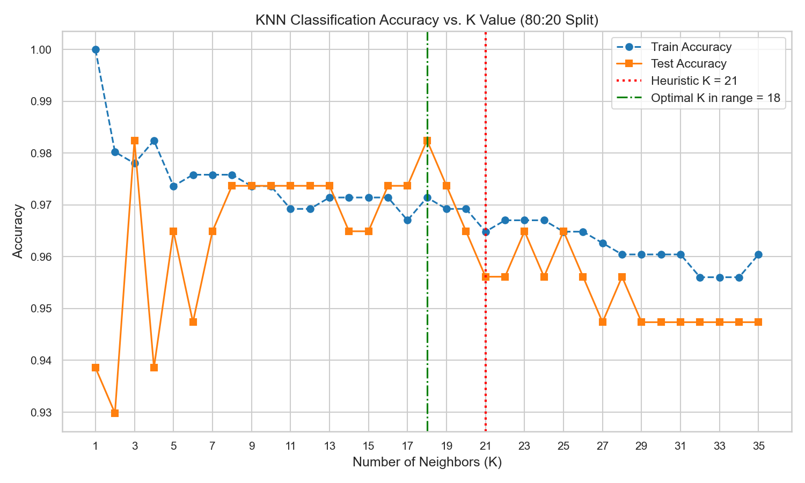
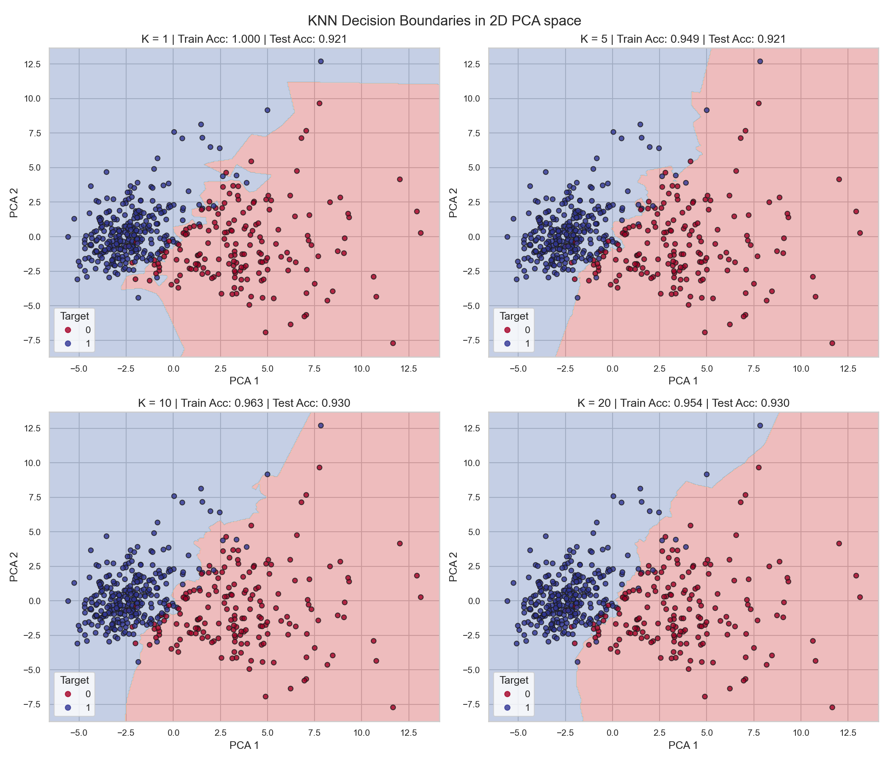
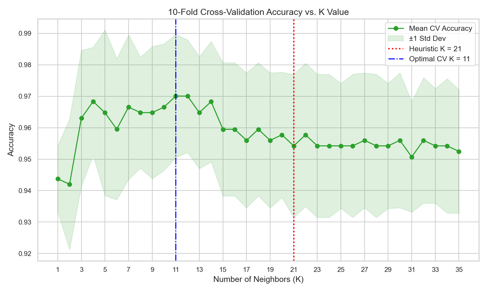
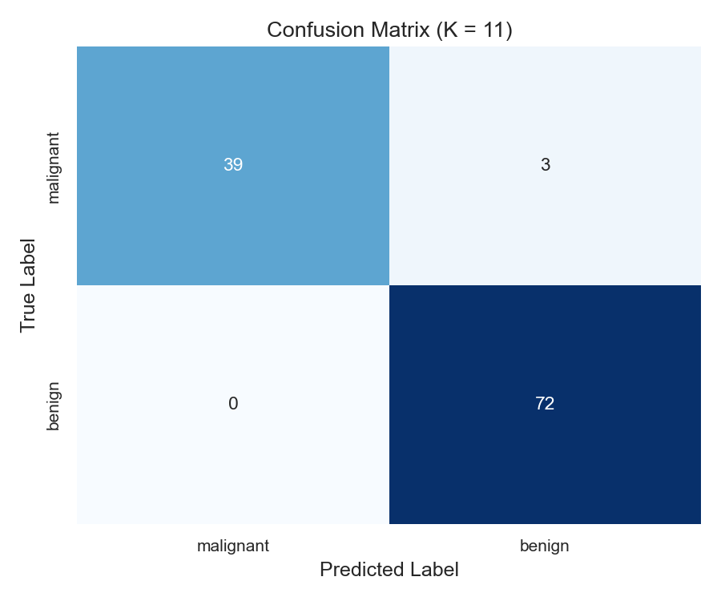
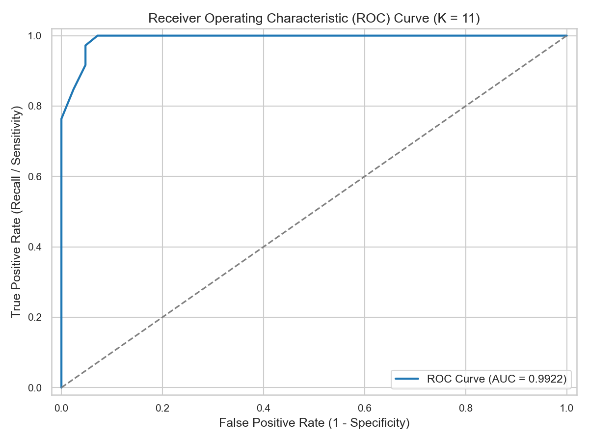

# Lab 4 Report: KNN Classification & Evaluation Metrics

**Course:** AIML Lab  
**Lab Assignment:** 04  
**Date:** July 7, 2026  

---

### Aim
In this lab, we implemented a K-Nearest Neighbors (KNN) classifier on the Breast Cancer Wisconsin dataset. We experimented with different train-test splits, found the best K value using the square root rule and cross-validation, and evaluated our final model. We also compared classification metrics (like Accuracy, Recall, and F1) with the regression metrics we used in Lab 3.

---

## 1. Task 1: Data Preparation
We used the Breast Cancer dataset, which has physical measurements of cell nuclei to determine if a tumor is benign or malignant.
- **Total Samples:** 569
- **Features:** 30 numerical features
- **Target Classes:** Malignant (0) and Benign (1)

### Checking the Data
We checked for missing values and duplicates and found none, so the data was good to go. We noticed there were slightly more benign cases (about 63%) than malignant ones (37%), but it wasn't a huge imbalance.

### Why We Scaled the Features
KNN calculates distance between points to find neighbors. If we don't scale the data, features with big numbers (like `area` which goes up to 2500) will completely overpower features with tiny decimals (like `smoothness` around 0.1). 
To fix this, we used `StandardScaler` so all features have a mean of 0 and a variance of 1.

---

## 2. Task 2: Train-Test Split Analysis
We wanted to see how changing the amount of training vs. testing data affects the model. We tried three splits: 80:20, 70:30, and 90:10. For this, we guessed a good K by taking the square root of the training size.

### How the Splits Performed

| Split | Train Size | Test Size | K Used | Train Accuracy | Test Accuracy | Precision | Recall | F1 Score |
| :---: | :---: | :---: | :---: | :---: | :---: | :---: | :---: | :---: |
| **80:20** | 455 | 114 | 21 | 96.48% | 95.61% | 94.67% | 98.61% | 96.60% |
| **70:30** | 398 | 171 | 21 | 96.98% | 94.74% | 92.24% | 100.00% | 95.96% |
| **90:10** | 512 | 57 | 23 | 96.29% | 98.25% | 97.30% | 100.00% | 98.63% |

### What We Learned
- **90:10 Split:** It gave the highest accuracy, but the test set was too small (only 57 samples). Just getting one wrong changed the accuracy a lot, making it unreliable.
- **70:30 Split:** Gave the lowest accuracy. With fewer training samples, the model didn't have enough examples to learn the patterns well.
- **80:20 Split:** This was the best balance. It gave the model enough data to learn while keeping a large enough test set for a reliable evaluation.

---

## 3. Task 3: Finding the Best K

### The Square Root Rule
A quick way to find a good K is taking the square root of the number of training samples. 
For our 80:20 split (455 training samples), the square root is about 21.33. We rounded it to 21 because we always want an odd number to avoid voting ties.

### Testing Different K Values
We trained models with K ranging from 1 to 35:

- **When K is too small (like 1):** The model overfits. It perfectly memorizes the training data but does poorly on new data because it's sensitive to noise.
- **When K is too large:** The model underfits. It groups everything together and ignores the subtle differences between classes.
- We found that test accuracy peaked around K=18, but since we prefer odd numbers, we looked closely at K=17 and K=19.

### Distance Metrics & Visualizing Boundaries
We can use different ways to calculate distance:
- **Euclidean:** Straight-line distance. Good for normal data but can be affected by outliers.
- **Manhattan:** Grid-like distance. Better at handling outliers.

We also visualized how the model draws boundaries between the classes using PCA (to reduce the 30 features to 2D):

- At K=1, the boundary is very jagged, capturing every outlier.
- At K=5 and K=10, it gets smoother and looks more reasonable.
- At K=20, it's too smooth and starts missing details.

---

## 4. Task 4: Cross-Validation
A single train-test split can be lucky or unlucky depending on how the data was shuffled. To be sure about our K value, we used 10-Fold Cross-Validation. 
This splits the data into 10 chunks, tests on each chunk once, and averages the results.

Through cross-validation, we found that K=11 was actually the most stable and gave the best overall performance (97.01% average accuracy). So, we used K=11 for our final model.

---

## 5. Task 5: Final Model Evaluation
We took our final model (K=11) and evaluated it on our 80:20 test set.

### The Results
- **Accuracy:** 97.37%
- **Precision:** 96.00%
- **Recall (for Benign):** 100.00%
- **F1 Score:** 97.96%
- **ROC-AUC Score:** 0.9922

### Confusion Matrix

- **Correctly caught malignant cases:** 39
- **Correctly identified benign cases:** 72
- **False Alarms (Malignant misclassified as Benign):** 3
- **Missed Cases (Benign misclassified as Malignant):** 0

> [!IMPORTANT]
> If we look specifically at detecting cancer (Malignant), our model missed 3 cases. In the medical field, this is the most critical number because a false negative means a sick patient goes untreated. 

### ROC Curve

Our AUC score of 0.9922 is very high. It means our model is great at distinguishing between benign and malignant tumors.

---

## 6. Task 6: Comparing Classification with Regression (Lab 3)
In Lab 3, we used Linear Regression and looked at MAE, MSE, RMSE, and R-squared. Here’s how evaluating classification is different:

- **The Main Difference:** Regression checks how big your mistake is (like predicting a price). Classification just checks if you picked the right category.
- **R² vs. Accuracy:** Both give a percentage of how well you're doing. But Accuracy can be misleading if the data is skewed.
- **RMSE vs. F1 Score:** Both are balanced metrics. RMSE punishes predictions that are way off. F1 Score balances false positives and false negatives without caring about the "size" of the error.
- **MAE vs. Confusion Matrix:** MAE gives the average size of your mistakes. The Confusion Matrix tells you exactly what kind of mistakes you're making (false alarms vs. missed cases).

---

## 7. Task 7: Analytical Questions

### Q1: Why is KNN called a "lazy" algorithm?
Because it doesn't really "learn" a model beforehand. It just memorizes the training data. The actual calculation happens at the end when you ask it to make a prediction.

### Q2: Why do we have to scale features in KNN?
Since KNN relies on distance, a feature with big numbers (like area) will overshadow a feature with tiny numbers (like smoothness). Scaling puts everything on the same scale.

### Q3: What's the square root rule?
It’s a quick rule of thumb to pick a starting K. It gives a good middle ground so your K isn't too small (which captures noise) or too big (which ignores patterns).

### Q4: Why use cross-validation instead of a single split?
A single split can accidentally put all the easy cases in the test set. Cross-validation shuffles things around 10 times to give a truer average score.

### Q5: How does K affect overfitting and underfitting?
- **Small K:** Overfits. It pays too much attention to individual noisy data points.
- **Large K:** Underfits. It looks at too many neighbors and just predicts the most common class.

### Q6: In cancer prediction, why do we care more about recall than accuracy?
Accuracy treats all mistakes equally. Recall specifically looks at how many actual cancer cases we correctly caught. Missing a cancer diagnosis is more dangerous than a false alarm, so we prioritize recall.

### Q7: What happens if K is way too big?
The model gets lazy. If K is the size of the whole dataset, it will just always predict whichever class is the majority, ignoring the actual data.

---

## Conclusion
We built a KNN classifier to detect breast cancer. We saw that an 80:20 split is a good balance, and while the square root trick is a good start, cross-validation is the best way to find the final K (which was 11). 
Evaluating medical models is very different from regression. Instead of caring about the size of an error, we care about what kind of error we made, because missing a cancer diagnosis is a mistake we really want to avoid.
